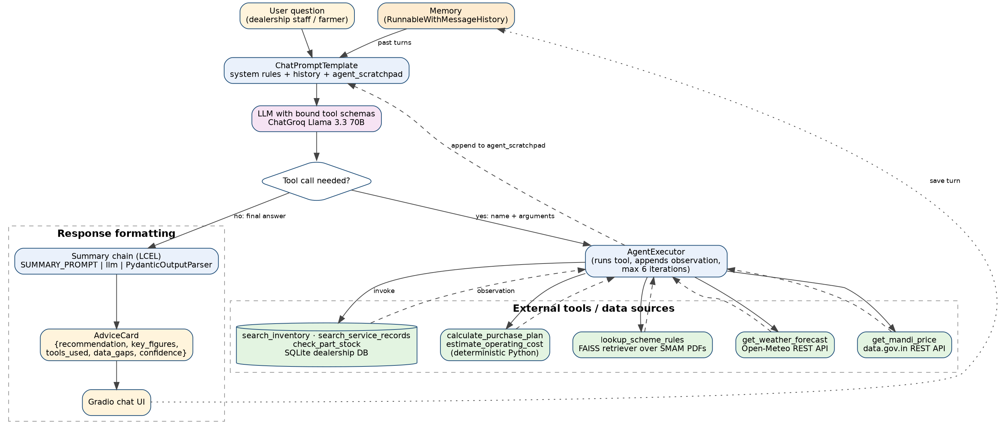
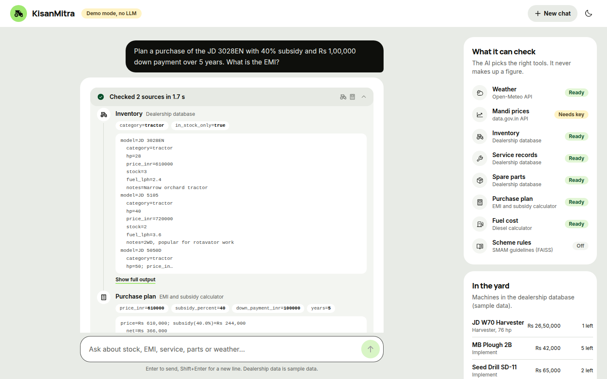

# KisanMitra 🚜: Tool-Augmented (Agentic) Dealership Assistant

PSIS Activity 2: *Build a Tool-Augmented/Agentic LLM Application*, B.Tech AI, MPSTME (2026–27)
Team: **I054 Anumay Pandey · I023 Yash Garg · I037 Yash Kothari**

## Quick start (Windows)
1. Install Python 3.10+ from [python.org](https://www.python.org/downloads/) and tick **"Add python.exe to PATH"**.
2. Double-click **`Start KisanMitra.bat`** in this folder.
3. Paste your free Groq API key when asked (or press Enter for demo mode). It is saved in `.env`, so you only do this once.
4. The app opens in your browser at http://localhost:8000. Close the black window to stop it.

The first run takes a few minutes to install packages; after that it starts in seconds. On Mac/Linux run `./start.sh`.
To change the key: `python launch.py --key`. To add the subsidy-document search (large download): `python launch.py --rag`.
If the AI model cannot start (wrong key, no internet), the app opens in demo mode and a yellow bar says why.

**Public link for anyone:** double-click **`Share KisanMitra (public link).bat`**. After a few seconds the window shows
a link like `https://some-words.trycloudflare.com` that works on any phone or computer, anywhere, while that window
stays open (it uses a free Cloudflare quick tunnel; the link changes each time). Each visitor can ask 20 questions per
hour so your Groq key is not used up.

**On your phone:** double-click **`Start KisanMitra (phone).bat`** instead. The window shows an address like
`http://192.168.1.5:8000`; open it on a phone connected to the same Wi-Fi (allow the firewall prompt on the PC).

## Problem
A tractor dealership answers the same questions all day: which machine fits a farmer's budget and land, what the EMI is after subsidy, whether a spare part is in stock, what a customer's machine was last serviced for, whether the next three days are dry enough to spray, and what a government scheme allows. The answers live in different places: a stock and service database, a weather service, a market price service, a subsidy PDF and a calculator. KisanMitra is an LLM **agent** that decides which of those sources to call, in what order, and combines them into one answer, without inventing any figure itself.

## Architecture


The LLM receives the tool schemas. At each step it either emits a tool call (name + arguments) or a final answer. `AgentExecutor` runs the tool, appends the observation to `agent_scratchpad`, and calls the model again, up to 6 iterations.

| Tool | Type | What it provides |
|---|---|---|
| `get_weather_forecast` | Public REST API (Open-Meteo, no key) | Rain, temperature and wind forecast for a location |
| `get_mandi_price` | REST API (data.gov.in, free key) | Recent mandi prices per quintal |
| `search_inventory`, `search_service_records`, `check_part_stock` | SQLite database | Machines, prices, stock, service history, spare parts |
| `calculate_purchase_plan`, `estimate_operating_cost` | Deterministic Python | Subsidy, EMI, interest, diesel consumption and cost |
| `lookup_scheme_rules` | FAISS retriever over SMAM PDFs | Subsidy rules with file and page citations |

| LangChain component | Where |
|---|---|
| Tool / Agent | `@tool` functions with Pydantic arg schemas; `create_tool_calling_agent` + `AgentExecutor` |
| ChatPromptTemplate + MessagesPlaceholder | `prompts.py` (system rules, history, `agent_scratchpad`) |
| Memory | `RunnableWithMessageHistory` per session |
| LCEL composition | `SUMMARY_PROMPT \| llm \| PydanticOutputParser` summary chain |
| OutputParser | `AdviceCard` (recommendation, key figures, tools used, data gaps, confidence) |
| VectorStoreRetriever | FAISS retriever exposed as the `lookup_scheme_rules` tool |

## Repository layout
```
src/kisanmitra/   config, tools, knowledge (RAG tool), prompts, schema, agent
scripts/          seed_db.py, evaluate.py
tests/            fake_llm.py, test_agent_offline.py   (run without any API key)
eval/             test_scenarios.json, results.csv (generated)
notebooks/        KisanMitra_Agent.ipynb (self-contained Colab version)
docs/             architecture diagram, progress notes
app.py            Gradio chat UI
server.py         FastAPI backend for the web UI (streams each tool call live)
frontend/         React + Vite + Tailwind web UI
```

## Run
**Colab:** open `notebooks/KisanMitra_Agent.ipynb` → Runtime → Run all → paste a free Groq key.

**Local:**
```bash
pip install -r requirements.txt
export GROQ_API_KEY=...          # free from console.groq.com
export DATAGOV_API_KEY=...       # optional; without it the mandi tool returns TOOL_ERROR by design
python scripts/seed_db.py
python tests/test_agent_offline.py   # agent loop tests, no API key needed
python scripts/evaluate.py           # writes eval/results.csv
python app.py                        # Gradio UI
```

**Web UI (React):**
```bash
cd frontend && npm install && npm run build && cd ..
python server.py                     # open http://localhost:8000
```
Every tool call appears in the chat as the agent makes it (tool, arguments, result), followed by the answer and the
structured `AdviceCard` (key figures, confidence, data gaps). Without `GROQ_API_KEY` the server starts in **demo mode**:
a rule-based router calls the same real tools so the UI can be tried offline; the header shows which mode is active.
For frontend development run `python server.py` and `cd frontend && npm run dev` (Vite proxies `/api` to port 8000).
`python tests/test_server.py` checks the API, including tool-call streaming with the scripted LLM.



## Evaluation
9 scenarios: single-tool database lookup, multi-step (inventory → EMI), memory follow-up, weather API, service history, fuel calculator, a deliberate tool failure (no mandi key), scheme lookup through the RAG tool, and an out-of-scope request that must be refused. Metrics: tool-selection correctness, error handling, tool calls per question, latency, and an independent Python re-computation of the EMI to verify the calculator's figure.

## Known limitations
- Tool choice depends on the model; an ambiguous question can trigger the wrong tool (seen in evaluation).
- The mandi dataset's commodity names must match exactly; a wrong name returns no records.
- Dealership data is synthetic; a real deployment would connect to the dealer management system read-only.
- English only, and the agent cannot write to the database (deliberately read-only).
